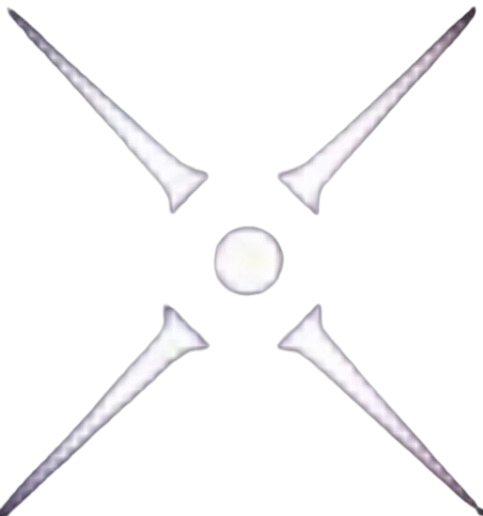
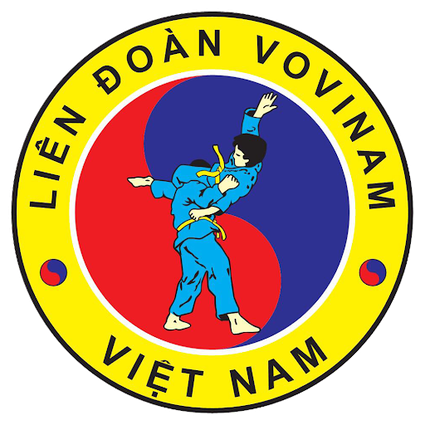

# 🥋 Nghiên cứu & Phát triển hệ thống chấm điểm động tác môn võ Vovinam
> 📘 **Dự án thuộc FSCHG KHKT**  
> © 2025 - FSCHG KHKT
---

## 👨‍🔬 FSCHG KHKT

✨ **Mentor**  
- 🧑‍🏫 *Lê Hữu Kỳ Quan*  

✨ **Members**  
- 👨‍💻 Trần Tiến Trung  
- 👨‍💻 Trần Đức Trọng  
- 👨‍💻 Nguyễn Ngô Gia Hưng  

---
## Cùng nhau nghiên cứu, sáng tạo và phát triển công nghệ cho Vovinam - võ cổ truyền Việt Nam!
> Together, we research, innovate, and develop technology for Vovinam – the traditional martial art of Vietnam!

  
    
  
    
  

